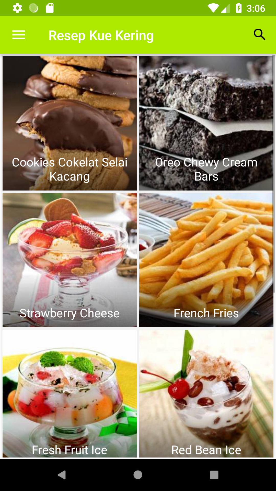
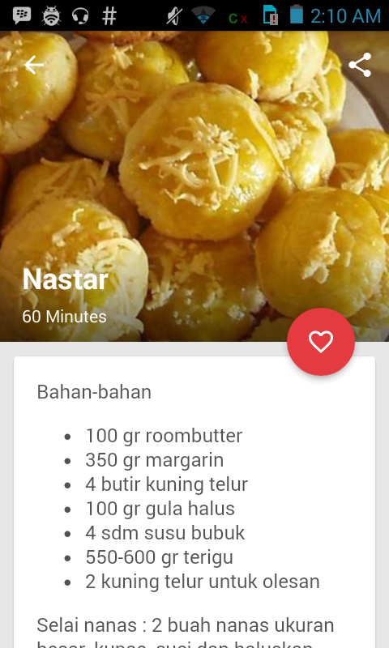
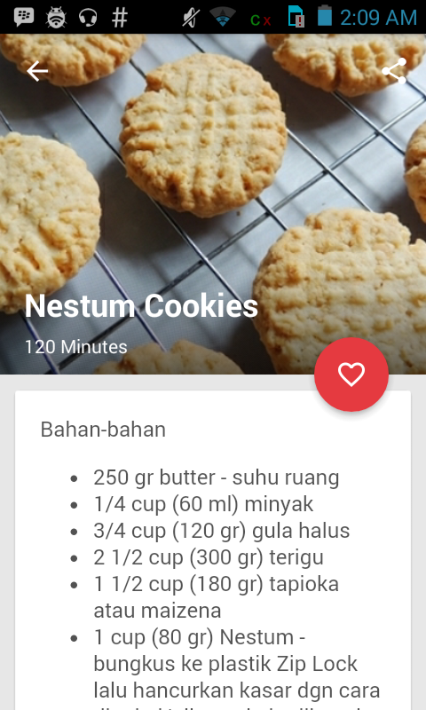
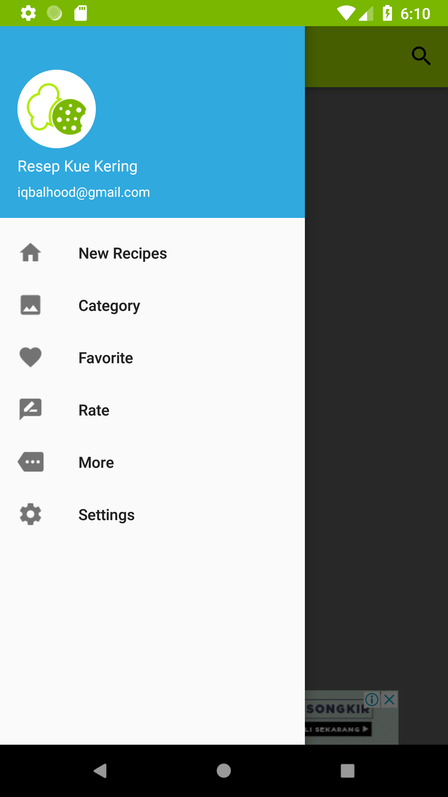

# Resep Kue Kering Praktis

This app is designed to give you complete information on how to make simple and delicious cookie recipes. To be eaten with family, whether in a special moments and other big days or for a snack while drinking tea and coffee. Find also the best recipes nastar, snow princess, peanut cake, kastengel, cat tongue, Lebaran pastry, pastries and many other processed variations

## Demo

  
  
  

  
  

### Download It

#### Made with &#9829;
Follow me on instagram :)
- [@iqbalhood](https://instagram.com/iqbalhood)

### Contribution Process

1. Submit an issue describing your proposed change to the repo in question.
1. The repo owner will respond to your issue promptly.
1. Fork the desired repo, develop and test your code changes.
1. Ensure that your code adheres to the existing style of the library to which
   you are contributing.
1. Ensure that your code has an appropriate set of unit tests which all pass.
1. Submit a pull request and cc @iqbal09
